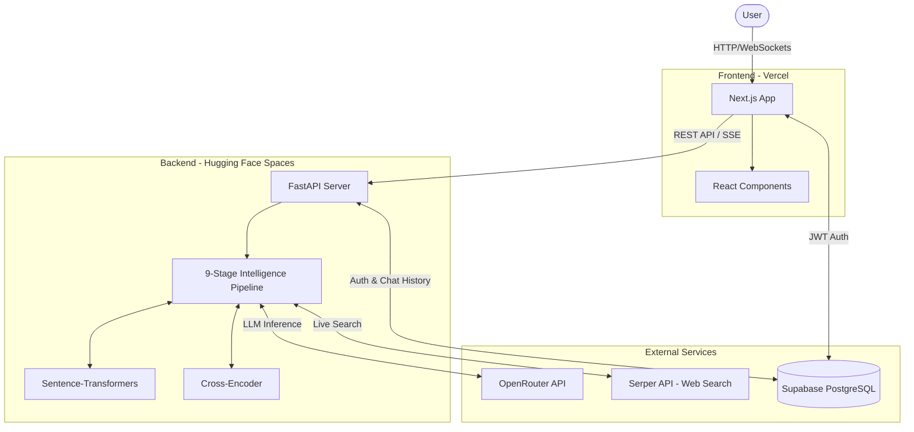
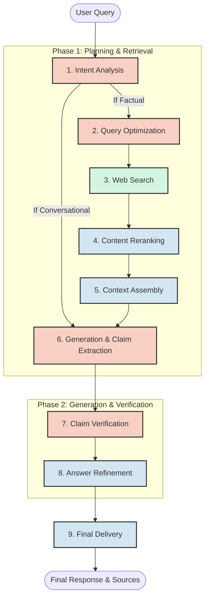

# System Architecture

GptOmni uses a modern, decoupled architecture consisting of a serverless frontend and a robust containerized backend for machine learning processing.

## High-Level Architecture

## Component Details

### 1. Frontend (Next.js)
* **Role:** Manages user interface, session state, and streaming data rendering.
* **Key Components:**
  * **Chat UI:** Handles user input and renders Markdown responses.
  * **Intelligence Engine Panel:** Parses Server-Sent Events (SSE) to update pipeline stages visually in real-time.
  * **Authentication:** Integrates with Supabase Auth for user sign-in.

### 2. Backend (FastAPI)
* **Role:** Orchestrates the 9-stage pipeline and heavy ML operations.
* **Key Components:**
  * **Streaming Endpoint (`/api/chat`):** Streams JSON chunks via Server-Sent Events (SSE) so the frontend can update stage-by-stage without waiting for the full pipeline to finish.
  * **ML Services:** Loads PyTorch models (`all-MiniLM-L6-v2` and `ms-marco-MiniLM-L-6-v2`) into RAM upon startup to perform semantic similarity matching and cross-encoder reranking on retrieved web data.

### 3. Database (Supabase)
* **Role:** Provides Row-Level Security (RLS) PostgreSQL storage and JWT authentication.
* **Schema:**
  * `conversations`: Stores chat sessions (id, user_id, title, created_at).
  * `messages`: Stores individual messages (id, conversation_id, role, content, run_id).

### 4. OpenRouter API
* **Role:** Multiplexer for LLM access. It automatically handles failovers. The backend uses different models for different tasks (e.g., small fast models for Intent parsing, large models for Final Generation).

## Intelligence Engine Pipeline Design

The 9-stage pipeline is the core mechanism of GptOmni, ensuring that all factual responses are grounded in verified external data.

### Pipeline Stage Breakdown
* **Stage 1 (Intent Analysis):** A fast LLM (e.g., Llama 3.2 3B) categorizes the user prompt.
* **Stage 2 (Query Optimization):** The LLM translates the prompt into 2-3 optimal Google search queries.
* **Stage 3 (Web Search):** The Serper API executes the queries in parallel, fetching the top 10 results for each.
* **Stage 4 (Reranking):** Local `Sentence-Transformers` and `Cross-Encoder` models score the raw snippets against the original query to find the most relevant chunks.
* **Stage 5 (Context Assembly):** High-scoring snippets are concatenated into an Evidence Block.
* **Stage 6 (Generation):** A large, high-capacity LLM (e.g., Gemma 4 31B) reads the Evidence Block, generates an answer, and strictly extracts the factual claims made in its own answer.
* **Stage 7 (Verification):** A mid-size reasoning LLM acts as an auditor, strictly cross-referencing each extracted claim against the Evidence Block to output a boolean `True` (verified) or `False` (hallucinated).
* **Stage 8 (Refinement):** Python logic annotates the answer, inserting footnotes for verified claims and warnings for unverified claims.
* **Stage 9 (Final Delivery):** The payload is finalized and streamed down to the client.
