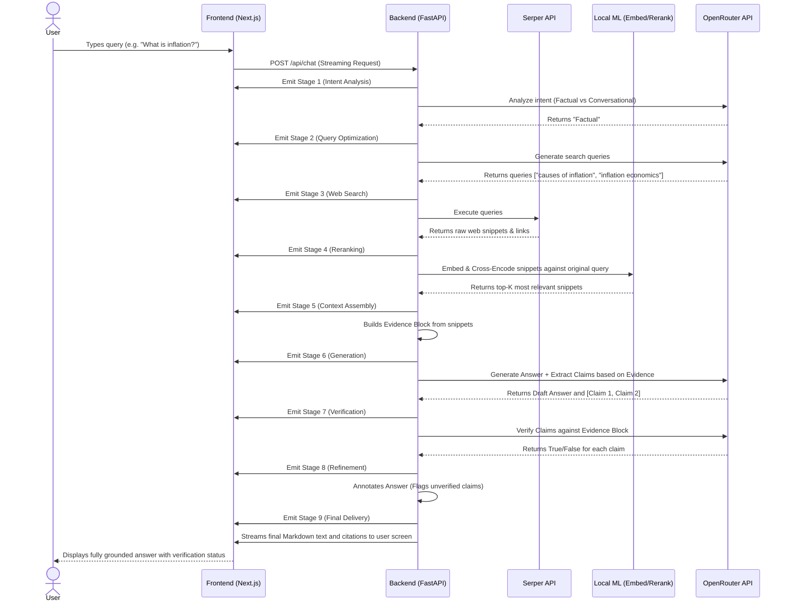

# User Flow Diagram

This document illustrates how a user interacts with the system and how the request flows through the various stages of the Intelligence Engine before the response is returned.

## Main Interaction Flow

## Key User Actions
1. **New Chat:** User starts a session. Supabase creates a conversation record.
2. **Sending a Message:** Initiates the SSE connection.
3. **Intelligence Engine Inspection:** User can click the "Intelligence Engine" dropdown in the UI to see the real-time logs of the sequence diagram above.
4. **Saving:** Once the SSE stream finishes, the frontend sends a `POST /api/messages` to persist the Assistant's reply.
